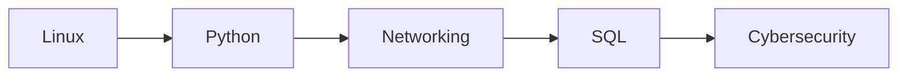

<div align="center">


<a href="https://git.io/typing-svg">
  
</a>

<br />


</div>

---

## Introduction

Hi, I'm **Mohamed Muktar Ibrahim** — a Cybersecurity Operations student at **Highline College**, working toward a career as a **SOC Analyst**.

My learning happens in the terminal. I set up labs, break things on purpose, read the error messages, and write down what I learned. Right now that means getting fluent with **Linux**, understanding how traffic actually moves across a **network**, automating repetitive work with **Python**, and querying data with **SQL**.

I believe security is a practical discipline. Reading about a concept is a starting point — configuring it, testing it, and documenting the result is where it becomes real knowledge. This profile is where I keep the record of that work.

---

## About Me

🎓 &nbsp;Cybersecurity Operations Student

🐧 &nbsp;Linux enthusiast

🌐 &nbsp;Networking learner

🐍 &nbsp;Python programmer

🔐 &nbsp;Cybersecurity learner

📚 &nbsp;Building my portfolio through projects and labs

## 📈 Contribution Activity

[](https://github.com/mohamuktar)

---

## Current Learning

| Focus | What I'm working on |
| :--- | :--- |
| **Linux** | Command line, file systems, permissions, shell navigation |
| **Networking** | Protocols, addressing, routing and switching fundamentals |
| **Python** | Scripting, problem solving, and automating repetitive tasks |
| **SQL / MariaDB** | Databases, tables, queries, and reading data from the terminal |
| **Cybersecurity Fundamentals** | Core security concepts, defensive practices, and lab work |
| **Git & GitHub** | Version control, repository structure, and documenting projects |

---

## Technology Stack

**Currently working with**

<p align="left">
  
</p>


**Next on the bench**

<p align="left">
  
</p>


---

## Featured Projects

| Project | Description | Tech |
| :--- | :--- | :--- |
| **[Learning-Python](YOUR_GITHUB_URL)** | Python programs, exercises, and automation practice. | `Python` |
| **[Learning-SQL](YOUR_GITHUB_URL)** | SQL fundamentals using MariaDB. | `SQL` `MariaDB` `Linux` |
| **[Cybersecurity Journey](YOUR_GITHUB_URL)** | Cybersecurity notes, labs, and technical documentation. | `Linux` `Security` |
| **[CCNA Journey](YOUR_GITHUB_URL)** | Networking studies and Packet Tracer labs. | `Networking` `Cisco` |

---

## Learning Roadmap

```text
Linux           ██████████████████░░░░░░░░░░   In progress
Python          ███████████████░░░░░░░░░░░░░   In progress
Networking      ████████████░░░░░░░░░░░░░░░░   In progress
SQL             ██████████░░░░░░░░░░░░░░░░░░   In progress
Cybersecurity   ████████░░░░░░░░░░░░░░░░░░░░   In progress
```



---

## Certifications (In Progress)

| Certification | Status |
| :--- | :--- |
| CompTIA Security+ | Planned |
| CompTIA Network+ | Planned |
| Cisco CCNA | Planned |

---

## 📊 GitHub Analytics

<div align="center">


<br><br>


</div>

---

## Writing & Knowledge Sharing

Documenting what I learn is part of how I learn it.

- **Substack** — articles on cybersecurity concepts, written for people starting out
- **Write-ups** — walkthroughs of the labs and exercises I complete
- **Technical notes** — command references, configuration notes, and troubleshooting logs

Each repository above carries its own notes, including the mistakes I made and how I resolved them.

---

## Connect With Me

<div align="center">

<a href="YOUR_LINKEDIN_URL">
  
</a>
&nbsp;
<a href="YOUR_GITHUB_URL">
  
</a>

<br /><br />

<sub>Learning in public, one lab at a time.</sub>


</div>
